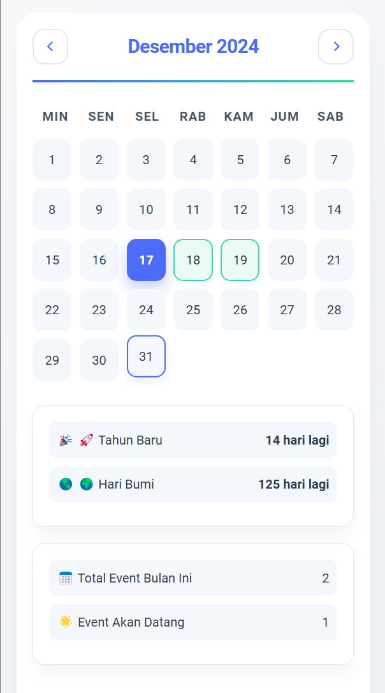
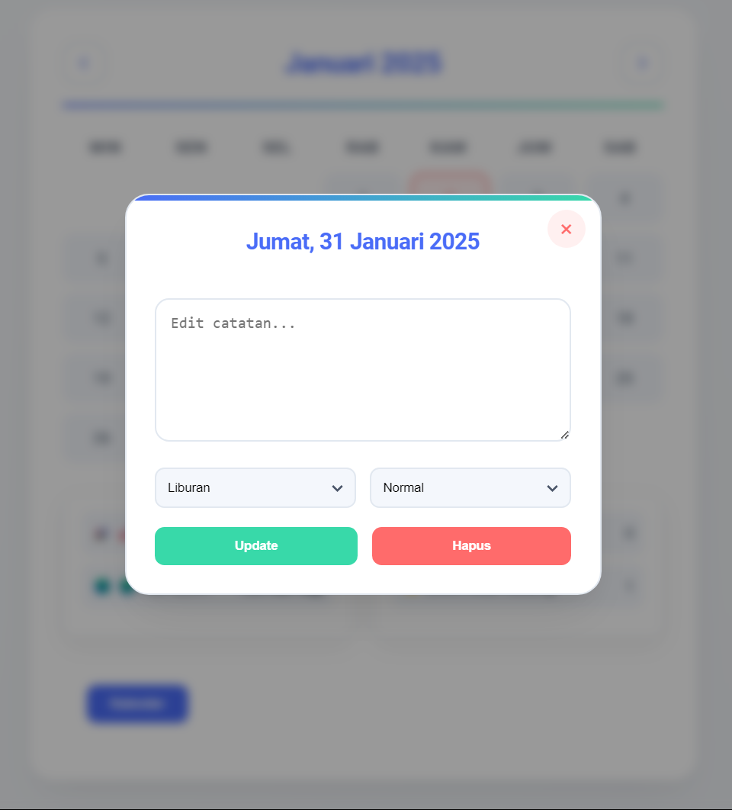

# 📅 Calendar

A modern and intelligent calendar application that helps you stay organized with powerful event tracking, countdowns, and smart reminders. Plan your future with confidence!

## ✨ Key Features

### 📌 Event Management
- Create, edit, and delete events easily
- Add custom markers and labels
- Set priority levels for events
- Attach notes and descriptions
- Multi day event support

### ⏳ Countdown Timer
- Track important upcoming events
- Automatic countdown updates
- Custom countdown notifications
- Visual countdown displays
- Support for multiple simultaneous countdowns

### 📊 Monthly Overview
- See total events per month at a glance
- Monthly event distribution graph
- Category-wise event breakdown
- Busy day highlights
- Event density visualization

### 📆 Extended Calendar Support
- Full suitable for all dates onwards
- Long term event planning
- Holiday and special date marking
- Recurring event setup
- Annual event reminders

## 🚀 Getting Started

### Prerequisites
- Modern web browser
- JavaScript enabled
- Local storage access

### Installation

1. Clone the repository:
```bash
git clone https://github.com/rexzea/Calender.git
```

2. Open `index.html` in your browser

## 💡 Usage Guide

### Creating Events
1. Click on any date
2. Fill in event details
3. Set markers and categories
4. Add countdown if needed
5. Save your event

### Setting Up Countdowns
1. Select target date
2. Choose countdown type
3. Set notification preferences
4. Add custom message
5. Activate countdown

### Monthly Statistics
- View total events via dashboard
- Check event categories distribution
- Monitor busy periods
- Track deadline clustering

## 🛠️ Built With

- HTML5
- CSS3
- JavaScript
- Local Storage API
- Date Management Library

## 📱 Preview





## 📊 Features in Detail

### Marker System
- Color-coded event markers
- Custom icon support
- Priority indicators
- Category-based marking
- Quick-view markers

### Event Counter
- Daily event totals
- Monthly statistics
- Yearly overview
- Category distribution
- Trend analysis

### Countdown System
- Multiple countdown support
- Custom notifications
- Visual progress bars
- Milestone alerts
- Flexible time units

## 🔜 Upcoming Features

- Dark mode support
- Cloud sync capabilities
- Calendar sharing
- Advanced recurring events
- Mobile app version

## 🤝 Contributing

We welcome contributions! Here's how:

1. Fork the repository
2. Create your feature branch (`git checkout -b feature/AmazingFeature`)
3. Commit your changes (`git commit -m 'Add some AmazingFeature'`)
4. Push to the branch (`git push origin feature/AmazingFeature`)
5. Open a Pull Request

## ⚙️ Configuration

### Time Zone Settings
- Automatic time zone detection
- Manual time zone override
- Multiple time zone display
- Time format customization

### Notification Preferences
- Email notifications
- Browser notifications
- Custom alert sounds
- Notification frequency
- Priority-based alerts

## 📜 License

This project is licensed under the MIT License - see the [LICENSE](LICENSE) file for details.

## 📫 Contact

Email : futyfary@gmail.com

No : +62 898-8610-455


## 💪 Support

If you find this calendar helpful:
- Give it a star ⭐
- Share with friends and colleagues
- Report bugs and suggest features
- Contribute to development

---
Organized with 💙 by [Rexzea] - Making time management smarter
